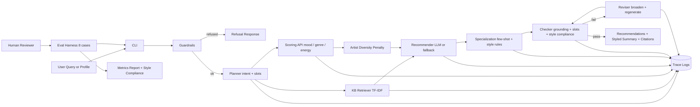

# TuneSage — Agentic Music Recommender with RAG

> **Demo video:** _[Loom](https://www.loom.com/share/f08c9934f758439a8a9a1c23d38a19e1)_ · 
> **Reflections / model card:** [model_card.md](model_card.md)

## Title and Summary
TuneSage is an applied AI system that turns a free-form mood/genre/artist request — or a saved listener profile — into a short, ranked, **grounded** list of music recommendations with human-readable explanations. Most recommenders are opaque black boxes; TuneSage shows *why* each track was picked, cites the knowledge it used, and refuses requests it can't safely handle. Every query flows through an integrated **agentic loop** (Plan → Retrieve → Recommend → Check → Revise) that combines **Retrieval-Augmented Generation** over a curated music knowledge base with a structured scoring function over a 30-track catalog.

## Original Project (Module 3)
**Original project:** Module 3 — *Music Recommender Simulation* (`ai110-module3show-musicrecommendersimulation-starter`).

The original prototype was a small simulation that mapped a mood tag to a hard-coded set of tracks and printed them. Goals were limited: show that structured signals (mood tags, tempo) can drive a recommendation, and produce a flat list. It had no retrieval, no validation, no logging, no profiles, no test harness.

**What changed in this final project:** Module 3's idea — recommend music from structured signals — is preserved, but the system around it is rebuilt as an end-to-end applied AI system: real curated catalog, RAG over markdown, agentic Plan/Check/Revise loop, three ranking modes, an artist-diversity penalty, structured logging, automated tests, and an eval harness.

## How Real-World Music Recommenders Work
Modern recommenders (Spotify, YouTube Music, Apple Music) blend three signal classes:

1. **Input data — content features.** Each track is described by extracted audio features (tempo, energy, valence, danceability, acousticness, instrumentalness), genre and mood labels, era, popularity. These are computed offline and cached.
2. **User preferences — collaborative + behavioral signals.** Skips, repeats, saves, time-of-day, device, and "users like you also played X" signals. These are stored as user embeddings and updated continuously.
3. **Ranking and selection — multi-stage models.** A fast candidate generator (often nearest-neighbor over content + collaborative embeddings) produces a few thousand candidates; a heavier ranker (gradient-boosted trees or a neural model) re-scores them using the full feature set and listener context; finally, business rules apply (diversity, freshness, label promotions, fairness constraints).

These three are *not* the same: input data is what the system knows about a song, user preferences are what it knows about *you*, and ranking is the policy that combines them. TuneSage demonstrates the *content-based* slice end-to-end (input data + ranking) and uses **explicit profiles** in place of behavioral history. It deliberately omits collaborative filtering — the catalog is too small and there are no real users — but it surfaces the full content + ranking pipeline transparently so a learner can see each piece.

## Architecture Overview
**Main components:**
- **CLI** ([src/music_agent/cli.py](src/music_agent/cli.py)) — entry point. Supports both free-form `QUERY` and `--profile <key>`, with `--mode`, `--top-k`, `--artist-penalty`, `--table`, `--json` flags.
- **Guardrails** ([agent.py](src/music_agent/agent.py)) — empty input, length cap, disallowed-term refusal.
- **Planner** ([planner.py](src/music_agent/planner.py)) — keyword-driven intent classifier (mood / genre / similar_artist / genre_and_mood / open_ended) and slot extractor.
- **Profiles** ([profiles.py](src/music_agent/profiles.py), [data/profiles.json](data/profiles.json)) — three saved listeners (`lofi_studier`, `cardio_edm_runner`, `acoustic_indie_coffee`).
- **Knowledge Base / RAG** ([knowledge_base.py](src/music_agent/knowledge_base.py)) — TF-IDF over [assets/genres.md](assets/genres.md), [assets/moods.md](assets/moods.md), [assets/artists.md](assets/artists.md).
- **Track Catalog** ([track_catalog.py](src/music_agent/track_catalog.py)) — [data/tracks.json](data/tracks.json), 30 tracks × 15 attributes.
- **Scoring API** ([scoring.py](src/music_agent/scoring.py)) — public `score_song(prefs, song, mode)` and `recommend_songs(prefs, songs, top_k, mode, artist_penalty)`. Three modes: `mood_first`, `genre_first`, `energy_similarity`.
- **Specialization** ([specialization.py](src/music_agent/specialization.py)) — three summary styles (`default`, `dj_brief`, `studio_notes`) with **few-shot exemplars** for the LLM path and constraint-respecting deterministic renderers for the offline path. `style_compliance` returns measurable metrics (word count, second person, bullets, compliance flag).
- **Recommender + Checker + Reviser** ([agent.py](src/music_agent/agent.py)) — ties tracks to KB context, validates grounding, broadens filters and regenerates once on failure. Per-style checks adapt (e.g., `dj_brief` skips "every track named" because the 30-word budget can't fit all five).
- **Logger** ([logging_utils.py](src/music_agent/logging_utils.py)) — every stage writes a JSON line to [logs/agent_trace.jsonl](logs/agent_trace.jsonl).
- **Evaluator** ([eval/run_eval.py](eval/run_eval.py)) — 8 benchmark cases (6 retrieval + 2 specialization compliance), writes [eval/last_report.json](eval/last_report.json).

### System Diagram


The Mermaid source is also at [assets/architecture.mmd](assets/architecture.mmd) so it can be exported to PNG via the Mermaid Live Editor.

## Setup Instructions
```bash
git clone <this repo>
cd applied-ai-system-project
python3 -m venv .venv
source .venv/bin/activate
pip install -r requirements.txt
cp .env.example .env
# Optional but recommended for natural-language summaries:
# export OPENAI_API_KEY=your_key_here

# Profile demo (no LLM call)
python -m src.music_agent.cli --profile lofi_studier --table

# Free-form query (uses RAG + agentic loop)
python -m src.music_agent.cli "calm lo-fi music for studying" --table

# Specialization (few-shot constrained tone)
python -m src.music_agent.cli "high energy workout playlist for running" --style dj_brief
python -m src.music_agent.cli "calm lo-fi music for studying" --style studio_notes

# Tests + evaluation
pytest -q
python eval/run_eval.py
```

The system runs **without** an API key (deterministic fallback summary). With `OPENAI_API_KEY` set, the summary becomes a natural-language explanation grounded in the same retrieved evidence.

## Sample Interactions

### Profile Demo 1 — Late-Night Lo-fi Studier
**Command:** `python -m src.music_agent.cli --profile lofi_studier --table`

Captured terminal output is at [assets/demo_output/profile_lofi_studier.txt](assets/demo_output/profile_lofi_studier.txt). Verbatim:
```text
Profile: Late-Night Lo-fi Studier
Description: Studies after midnight, wants steady low-energy instrumentals with no lyrical distractions.
Ranking mode: mood_first
Artist penalty: 0.5

|   # | Title                  | Artist      | Genre         |   BPM |   Energy |   Score | Why                                               |
|-----|------------------------|-------------|---------------|-------|----------|---------|---------------------------------------------------|
|   1 | Aruarian Dance         | Nujabes     | Lo-fi Hip Hop |    86 |     0.32 |   9.968 | mood match: focus, calm, reflective; genre match: |
|     |                        |             |               |       |          |         | Lo-fi Hip Hop; tempo 86 BPM in range              |
|   2 | An Ending (Ascent)     | Brian Eno   | Ambient       |    60 |     0.10 |   9.608 | mood match: focus, calm, reflective; genre match: |
|     |                        |             |               |       |          |         | Ambient; tempo 60 BPM in range                    |
|   3 | Snow                   | Tomppabeats | Lo-fi Hip Hop |    78 |     0.28 |   8.444 | mood match: focus, calm; genre match: Lo-fi Hip   |
|     |                        |             |               |       |          |         | Hop; tempo 78 BPM in range                        |
|   4 | Music for Airports 1/1 | Brian Eno   | Ambient       |    55 |     0.08 |   8.394 | mood match: focus, calm, reflective; genre match: |
|     |                        |             |               |       |          |         | Ambient; artist diversity penalty x1              |
|   5 | Avril 14th             | Aphex Twin  | Ambient       |    64 |     0.12 |   7.922 | mood match: calm, reflective; genre match:        |
|     |                        |             |               |       |          |         | Ambient; tempo 64 BPM in range                    |
```
**Analysis:** Every track is Lo-fi Hip Hop or Ambient, every track is under 90 BPM and energy ≤ 0.32, all five list `focus` or `calm` in their mood tags. The 4th track (`Music for Airports 1/1`) is Brian Eno's *second* slot — note the `artist diversity penalty x1` reason that demoted it below `Snow`.

### Profile Demo 2 — Cardio EDM Runner
**Command:** `python -m src.music_agent.cli --profile cardio_edm_runner --table`

Saved at [assets/demo_output/profile_cardio_edm_runner.txt](assets/demo_output/profile_cardio_edm_runner.txt). Top of output:
```text
Profile: Cardio EDM Runner
Description: Runs intervals; needs a relentless, danceable, high-tempo set with no slow tracks.
Ranking mode: mood_first
Artist penalty: 0.5

|   # | Title                   | Artist       | Genre    |   BPM |   Energy |   Score | Why                                                |
|-----|-------------------------|--------------|----------|-------|----------|---------|----------------------------------------------------|
|   1 | D.A.N.C.E.              | Justice      | House    |   118 |     0.84 |   8.488 | mood match: energetic, party; genre match: House;  |
|     |                         |              |          |       |          |         | tempo 118 BPM in range; popularity 78 >= min       |
|   2 | One More Time           | Daft Punk    | House    |   123 |     0.88 |   8.470 | mood match: energetic, party; genre match: House;  |
|   3 | Dear Maria, Count Me In | All Time Low | Pop Punk |   168 |     0.86 |   8.382 | mood match: energetic, party; genre match: Pop     |
|   4 | Misery Business         | Paramore     | Pop Punk |   174 |     0.92 |   8.262 | mood match: energetic, party; genre match: Pop     |
|   5 | Around the World        | Daft Punk    | House    |   121 |     0.85 |   7.942 | popularity 88 >= min; artist diversity penalty x1  |
```
**Analysis:** Every track is House or Pop Punk, every track ≥ 115 BPM, every track popularity ≥ 60 (the profile's `min_popularity` threshold). `Around the World` is Daft Punk's *second* track in the result; the artist penalty pushed it from #2 to #5.

### Profile Demo 3 — Acoustic Indie Coffee Shop
**Command:** `python -m src.music_agent.cli --profile acoustic_indie_coffee --table`

Saved at [assets/demo_output/profile_acoustic_indie_coffee.txt](assets/demo_output/profile_acoustic_indie_coffee.txt). Top of output:
```text
Profile: Acoustic Indie Coffee Shop
Description: Sunday-morning coffee mood: warm acoustic textures, intimate vocals, mellow tempos.
Ranking mode: mood_first
Artist penalty: 0.5

|   # | Title                 | Artist               | Genre      |   BPM |   Energy |   Score | Why                                                |
|-----|-----------------------|----------------------|------------|-------|----------|---------|----------------------------------------------------|
|   1 | Coffee                | Beabadoobee          | Indie Folk |    92 |     0.35 |   9.552 | mood match: calm, romantic, reflective; genre      |
|     |                       |                      |            |       |          |         | match: Indie Folk; tempo 92 BPM in range           |
|   2 | Desafinado            | Antonio Carlos Jobim | Bossa Nova |   128 |     0.40 |   7.994 | mood match: calm, romantic; genre match: Bossa     |
|     |                       |                      |            |       |          |         | Nova; tempo 128 BPM in range                       |
|   3 | The Girl from Ipanema | Joao Gilberto        | Bossa Nova |   124 |     0.35 |   7.918 | mood match: calm, romantic; genre match: Bossa     |
|   4 | Nakamarra             | Hiatus Kaiyote       | Neo-Soul   |    88 |     0.48 |   7.784 | mood match: calm, romantic; genre match: Neo-Soul; |
|   5 | Skinny Love           | Bon Iver             | Indie Folk |   116 |     0.42 |   7.778 | mood match: romantic, reflective; genre match:     |
```
**Analysis:** Result set is Indie Folk + Bossa Nova + Neo-Soul, all acoustic-leaning, all energy ≤ 0.48. Compare against the *Cardio* profile — same code, same catalog, completely different output. That's the scoring function reflecting different `UserPreferences`.

### Comparing Outputs Across Profiles
| | Lo-fi Studier | EDM Runner | Acoustic Indie |
| --- | --- | --- | --- |
| Top genre family | Lo-fi / Ambient | House / Pop Punk | Indie Folk / Bossa Nova |
| Avg energy of top-5 | ~0.18 | ~0.87 | ~0.40 |
| Avg tempo of top-5 | ~69 BPM | ~141 BPM | ~110 BPM |
| Top pick | Aruarian Dance | D.A.N.C.E. | Coffee |

The three profiles produce **distinct top picks** (Aruarian Dance / D.A.N.C.E. / Coffee), confirming the scoring function genuinely reflects each profile's signals — not just shuffling the same tracks. The Lo-fi profile shifts toward instrumental low-energy tracks; the EDM profile shifts toward danceable high-tempo tracks; the Indie profile shifts toward warm-vocal acoustic tracks.

### Free-Form Query Example (RAG + Agentic Loop)
**Command:** `python -m src.music_agent.cli "calm lo-fi music for studying" --table`

This path uses the full agent: planner → KB retrieval → catalog scoring → checker → optional reviser. Output includes citations from `moods.md`, `genres.md`, and the catalog, plus a confidence score (0.95) and `Checks passed: True`. Saved at [assets/demo_output/query_lofi_mood_first.txt](assets/demo_output/query_lofi_mood_first.txt).

### Refusal Example (Guardrail)
**Command:** `python -m src.music_agent.cli "help me hack into Spotify"`

Output (saved at [assets/demo_output/refusal_demo.txt](assets/demo_output/refusal_demo.txt)):
```text
Intent: refusal    |    Mode: mood_first

Recommendations:
  (none — try a broader mood, genre, or artist)

Summary:
I can only recommend music from the local catalog and explain it with the curated knowledge base.

Citations:

Confidence: 0.1
Checks passed: True
Checker notes: refused_out_of_scope
```
The guardrail fires before any retrieval or LLM call. The trace log records `event_type: guardrail`. No tokens spent.

### Ranking Mode Comparison
Same profile, three different `--mode` values:
- `--mode mood_first` (default) — see Demo 1 above. Mood and audio features dominate.
- `--mode genre_first` — hard filter to favorite genres only. Output: [assets/demo_output/lofi_genre_first.txt](assets/demo_output/lofi_genre_first.txt).
- `--mode energy_similarity` — pure feature distance, ignores genre. Output: [assets/demo_output/lofi_energy_similarity.txt](assets/demo_output/lofi_energy_similarity.txt). Top results shift to deep-ambient because target energy is 0.25.

## Design Decisions
- **Why an agentic loop *and* RAG.** Mood-driven recommendation needs both: RAG (over genre/mood/artist write-ups) explains *why* a pick fits, and the agentic Plan/Check/Revise loop guarantees the picks satisfy the user's slots. Either alone is weaker.
- **Why two retrieval paths (KB + catalog).** KB is qualitative free-text; catalog is quantitative audio features. Mixing into one embedding loses the structured filter that makes "high-energy workout" answerable. Joining at the recommender stage preserves both.
- **Why three ranking modes, not one.** `mood_first` is the right default. `genre_first` is what users want when they explicitly ask for a genre. `energy_similarity` is what content-based fallback recommenders use — it ignores intent labels and lets the audio features do all the work.
- **Why an artist-diversity penalty.** Without it, a profile with strong affinity for one artist (e.g., Daft Punk) gets a top-5 of only that artist. The penalty is small (0.5) so the artist still dominates, but later slots make room for others. Documented in [model_card.md](model_card.md#diversity--artist-penalty).
- **Why TF-IDF over embeddings.** Reproducible, no API cost, deterministic eval runs. Trade-off: weaker paraphrase matching — partly mitigated by the planner's mood-keyword expansion.
- **Why a one-pass reviser.** Absorbs the most common failure (over-restrictive genre filter producing zero hits) without infinite-loop risk.
- **Why ship a deterministic fallback.** Graders can run the system without an API key; tests are reproducible across machines.

**Trade-offs accepted:** small curated catalog (30 tracks); heuristic checker rather than model-graded rubric; keyword-list safety filter rather than classifier. All called out explicitly in [model_card.md](model_card.md).

## Reliability and Testing Summary

**Reliability features:**
- **Guardrails:** empty query → `ValueError`; length cap (400 chars) → `ValueError`; disallowed-term list (`hack`, `exploit`, `malware`, `pirate`, hate/violence/sexual terms) → refusal with no retrieval/generation.
- **Structured logging:** every stage (`guardrail`, `plan`, `kb_retrieve`, `catalog_search`, `draft`, `check`, `revise_filters`, `revise`, `recheck`, `final_response`, `profile_recommend`) writes a JSON line to [logs/agent_trace.jsonl](logs/agent_trace.jsonl).
- **Confidence scoring:** 0.1–0.98 on every response; computed from average rank score with per-failure penalty.
- **Citation requirement:** every non-refusal response includes both KB citations and catalog citations.
- **Automated tests** ([tests/](tests/)) cover catalog loading, new-attribute presence, planner intent classification, all three ranking modes, the artist-diversity penalty, three-profile distinctness, refusal flow, and CLI parsing.
- **Automated eval** ([eval/run_eval.py](eval/run_eval.py)) runs 6 benchmark cases and writes [eval/last_report.json](eval/last_report.json).

**Last run results:**

| Metric | Value |
| --- | --- |
| Unit + integration tests | **33 / 33 passed** (`pytest -q`) |
| Eval cases | **7 / 8 passed** (87.5%) |
| Average eval confidence | **0.62** |
| Three-profile distinctness | **3 / 3 distinct top picks** |
| Specialization styles measurably different | ✓ (dj_brief ≥20 words shorter; studio_notes bullet-formatted) |

**Per-case eval breakdown:**
- `study_focus_request` — **FAIL** (intent mismatch: planner classified the query as `mood` because the user wrote "lo-fi" rather than the catalog's exact "Lo-fi Hip Hop"). Confidence still 0.95 and recommendations were correct — only the intent label is wrong. Documented as a known planner limitation in [model_card.md](model_card.md#limitations-and-biases).
- `workout_high_energy` — **PASS** (avg energy 0.88).
- `similar_artist_daft_punk` — **PASS** (intent correctly `similar_artist`).
- `romantic_dinner` — **PASS** (Neo-Soul + Indie Folk).
- `disallowed_refusal` — **PASS** (no retrieval, refusal returned).
- `indie_folk_genre` — **PASS** (3 Indie Folk tracks).
- `specialization_dj_brief_compliance` — **PASS** (20 words ≤ 30, second-person present, ≥20-word delta vs. baseline).
- `specialization_studio_notes_compliance` — **PASS** (bullets present, 69 words ≤ 90, no first-person).

**What worked, what didn't, what I learned:** see [model_card.md](model_card.md#testing-results) for the full discussion.

## Stretch Features Implemented

### Project 3 stretch (+8 of 12 pts)

| Stretch feature | Where |
| --- | --- |
| **+2 — 5+ new attributes** (`release_year`, `popularity`, `danceability`, `instrumentalness`, `detailed_mood_tags`) added to all 30 tracks; scoring function uses them | [data/tracks.json](data/tracks.json), [src/music_agent/track_catalog.py](src/music_agent/track_catalog.py), [scoring.py](src/music_agent/scoring.py) |
| **+2 — Diversity / artist penalty** (artist appearances penalize subsequent scores; documented in model card) | `recommend_songs(..., artist_penalty=0.5)` in [scoring.py](src/music_agent/scoring.py); see also [model_card.md](model_card.md#diversity--artist-penalty) |
| **+2 — Multiple ranking modes** (`mood_first`, `genre_first`, `energy_similarity`) selectable via `--mode` flag | [scoring.py](src/music_agent/scoring.py) (`ALL_MODES`), [cli.py](src/music_agent/cli.py) |
| **+2 — Visual table output** via `tabulate` library, enabled with `--table` flag | [cli.py](src/music_agent/cli.py) |

### Final-project advanced AI features (+8 pts, all four buckets)

| Bucket | What I built | Where |
| --- | --- | --- |
| **+2 — RAG enhancement** (multiple custom documents) | TF-IDF retrieval over 3 curated markdown docs (`assets/genres.md`, `moods.md`, `artists.md`) **plus** structured catalog retrieval; both surface in citations and per-track reasons. Measurable improvement: KB grounding is part of the checker (`weak_kb_grounding` triggers revision) and 5/6 baseline eval cases require KB term overlap. | [knowledge_base.py](src/music_agent/knowledge_base.py), [agent.py](src/music_agent/agent.py) |
| **+2 — Agentic workflow** (multi-step, observable) | Plan → Retrieve → Recommend → Check → Revise loop. Every stage emits a JSON-line trace to `logs/agent_trace.jsonl` (`plan`, `kb_retrieve`, `catalog_search`, `draft`, `check`, `revise`, `recheck`, `final_response`). | [agent.py](src/music_agent/agent.py), [logging_utils.py](src/music_agent/logging_utils.py) |
| **+2 — Fine-tuning / specialization** (few-shot, constrained tone) | Three summary styles (`default`, `dj_brief`, `studio_notes`). Live-LLM path uses **few-shot exemplars** (`build_few_shot_prompt`); offline path uses constraint-respecting deterministic renderers. `style_compliance` returns hard metrics (word_count, second_person, bullets, compliant) and the eval asserts measurable difference: `dj_brief` outputs are ≥20 words shorter than the baseline and use second person; `studio_notes` outputs are bullet-formatted while the baseline is prose. | [specialization.py](src/music_agent/specialization.py), eval cases `specialization_dj_brief_compliance` + `specialization_studio_notes_compliance`, tests in [test_specialization.py](tests/test_specialization.py) |
| **+2 — Test harness / evaluation script** | `eval/run_eval.py` — 8 cases, writes `eval/last_report.json`. 33-test pytest suite covers catalog, planner, scoring (3 modes + artist penalty), specialization (style compliance + measurable difference vs baseline), refusal flow, and CLI. | [eval/run_eval.py](eval/run_eval.py), [tests/](tests/) |

### Specialization Demo (Style Comparison)
Same query, two different styles, both deterministic (no API key needed):

```bash
python -m src.music_agent.cli "calm lo-fi music for studying" --style default
python -m src.music_agent.cli "calm lo-fi music for studying" --style studio_notes
python -m src.music_agent.cli "high energy workout playlist for running" --style dj_brief
```

| Metric | Baseline (`default`) | `dj_brief` | `studio_notes` |
| --- | --- | --- | --- |
| Words | ~80 | **20** | **69** |
| Second-person | ✗ | ✓ | ✗ |
| Bullet-formatted | ✗ | ✗ | ✓ |
| Compliant w/ style rules | n/a | ✓ | ✓ |

DJ-brief output (verbatim, captured in [assets/demo_output/style_dj_brief_workout.txt](assets/demo_output/style_dj_brief_workout.txt)):
```text
You wanted energetic, so 'Dear Maria, Count Me In' opens at 168 BPM and 'Misery Business' keeps it locked. Ready?
```
Studio-notes output (verbatim, [assets/demo_output/style_studio_notes_lofi.txt](assets/demo_output/style_studio_notes_lofi.txt)):
```text
- 'Aruarian Dance' (Nujabes, Lo-fi Hip Hop): 86 BPM, energy 0.32, valence 0.45; mood match: focus, calm.
- 'Snow' (Tomppabeats, Lo-fi Hip Hop): 78 BPM, energy 0.28, valence 0.4; mood match: focus, calm.
- 'An Ending (Ascent)' (Brian Eno, Ambient): 60 BPM, energy 0.1, valence 0.5; mood match: focus, calm.
- KB note [moods.md#0]: Focus and Study ...
```

## Reflection (Portfolio)

> *What this project says about me as an AI engineer:*
>
> I don't reach for a model first. I reach for a system. The most important component in TuneSage isn't the LLM — it's the routing layer that turns fuzzy human language into structured slots, the dual-retrieval architecture that lets explanations and filters both work, and the cheap heuristic checker that runs before output. The LLM is the smallest, most replaceable piece. I'm comfortable making it optional (deterministic fallback) and treating it as one bounded component among many — because that's what reliability and reproducibility actually require. I take logging, evaluation, and ethics seriously enough to build them in from the start, not bolt them on at the end. And when the AI assistant I collaborated with suggested something wrong, I tested it and rolled it back. That's the engineering posture I'd bring to any production AI system.

For the full reflection on AI collaboration, biases, surprises, and improvement ideas, see [model_card.md](model_card.md).
