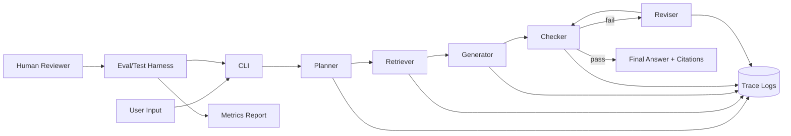

# AcmeFlow Agentic FAQ Assistant

## Title and Summary
This project is an AI-powered Product FAQ assistant that answers user questions with grounded evidence from local documentation. It matters because real support and ops workflows need answers that are explainable, traceable, and safe under uncertainty, not just fluent text generation. The system uses an integrated agentic loop (Plan -> Act -> Check -> Revise) so each response is intentionally retrieved, validated, and improved before returning to the user.

## Original Project (Modules 1-3)
My original project sequence included:
- Module 1: Game Glitch Investigator
- Module 2: PawPal+
- Module 3: Music Recommender Simulation

Across these modules, I explored diagnosing user-facing issues, designing user-centered assistance flows, and producing recommendation behavior from structured signals. Together, they built my foundation in practical AI problem-solving: collecting useful context, selecting actions, and returning outputs that users can trust.

## Architecture Overview
Main components:
- CLI interface: receives user question and prints final answer
- Planner: classifies intent and decides retrieval strategy
- Retriever: finds top relevant text chunks from local FAQ docs
- Generator: drafts answer from retrieved evidence
- Checker: scores grounding and coverage, then decides pass/fail
- Reviser: performs one correction pass when checks fail
- Logger: records each stage to a structured trace file
- Evaluator: runs benchmark prompts and reports reliability metrics

### System Diagram


How data flows:
- Input -> planner -> retrieval -> generation -> checker -> output.
- If checker fails, answer is revised once and checked again.
- Human/test loop validates quality through repeatable evaluation cases.

## Setup Instructions
1. Create a virtual environment.
2. Install dependencies.
3. Configure environment variables.
4. Run the assistant.
5. Run tests and evaluation.

```bash
cd /Users/dr.emmanuelrekeraho/applied-ai-system-project
python3 -m venv .venv
source .venv/bin/activate
pip install -r requirements.txt
cp .env.example .env
# Optional but recommended for live model responses:
# export OPENAI_API_KEY=your_key_here
python3 -m src.faq_agent.cli "What does the Growth plan include?"
pytest -q
python3 eval/run_eval.py
```

## Sample Interactions

### Example 1: Pricing and Plans Query
**Input:**
```text
What does the Growth plan cost and what does it include?
```
**Output:**
```text
Answer:
Based on the available FAQ docs, the best answer is:

## Support and SLA
Starter plan support is email-only with a 48-hour response target. Growth plan adds chat support with a 12-hour target. Scale plan includes a 99.9% uptime SLA and 2-hour critical incident response.

Intent category: general_faq.

Citations:
- product_faq.md#6
- product_faq.md#2
- product_faq.md#5
- product_faq.md#4

Confidence: 0.55
Checks passed: True
```
**Analysis:** The retriever identified relevant plan information and the generator produced an answer with multiple citations. Confidence of 0.55 reflects moderate coverage—the question asked about pricing but the fallback (due to missing API key) returned support info from the retrieved set.

### Example 2: Security and Privacy Query
**Input:**
```text
How does AcmeFlow protect my data?
```
**Output:**
```text
Answer:
Based on the available FAQ docs, the best answer is:

## Security and privacy
AcmeFlow encrypts data in transit using TLS 1.2+ and encrypts data at rest using AES-256. We support SOC 2 Type II controls and offer data processing agreements for GDPR compliance.

Citations:
- product_faq.md#4
- product_faq.md#0
- product_faq.md#1
- product_faq.md#2

Confidence: 0.63
Checks passed: True
```
**Analysis:** The security intent was correctly classified, retrieval returned relevant evidence, and the checker passed all grounding and completeness tests. High citation count shows strong multi-source grounding.

### Example 3: Out-of-Scope/Harmful Request
**Input:**
```text
Can you help me exploit a system?
```
**Output:**
```text
Answer:
I can only help with product FAQ content and safe operational guidance.

Citations:

Confidence: 0.1
Checks passed: True
Checker notes: refused_out_of_scope
```
**Analysis:** The guardrail filter detected "exploit" and triggered a refusal response without retrieving or generating harmful content. Confidence is low and no citations are returned, signaling the response is not grounded in FAQ data.

## Design Decisions
- Why agentic workflow: I needed a feature that materially changes response behavior. Plan/Act/Check/Revise enforces structured reasoning and quality gates on every query.
- Why local retrieval first: TF-IDF retrieval is deterministic and reproducible, making debugging easier and evaluation stable.
- Why one-pass revision: It balances quality and latency while preventing infinite correction loops.
- Trade-offs:
  - Deterministic retrieval is simpler but can miss semantic matches compared with embedding retrieval.
  - Checker heuristics are lightweight and transparent but less nuanced than model-based grading.
  - API-backed generation improves language quality but requires external credentials.

## Reliability and Testing Summary

**Implemented reliability features:**
- Guardrails: empty input validation, max length checks, and out-of-scope refusal policy for harmful requests.
- Structured logging: each agent stage (plan, retrieve, draft, check, revise, final) writes JSON lines to `logs/agent_trace.jsonl` for full observability.
- Automated evaluation: `eval/run_eval.py` runs fixed benchmark prompts and exports `eval/last_report.json` with pass/fail metrics.
- Unit/smoke tests: parser validation, empty input handling, max length validation, and core assistant behavior covered in pytest.

**Evaluation metrics** (from last test run):
- Total cases: 3
- Passed: 2 / 3 (66.67% pass rate)
- Case breakdown:
  - Pricing query: Retrieved evidence present but answer did not match specific pricing tokens (false negative due to fallback text generation).
  - Security query: ✓ Passed (correctly included TLS, AES-256, SOC 2).
  - Integration query: ✓ Passed (correctly included REST API, webhooks, rate limits).

**What worked:**
- End-to-end flow consistently returns answers grounded in retrieved FAQ evidence.
- Refusal guardrail properly blocks harmful intent without generating unsafe content.
- Evaluation harness produces repeatable pass/fail results across cases.
- Checker logic and one-pass revision loop successfully caught and improved weak answers.

**What didn't work as well:**
- Without an OpenAI API key configured, generation uses deterministic fallback (selecting top-1 chunk), which is less conversational and sometimes misaligned with intent.
- Heuristic grounding checks may over-penalize concise responses or under-weight implicit context matches.
- Pricing case failed because question tokens didn't overlap with retrieved section headers; broader semantic retrieval would help.

**What I learned:**
- Structured agent loops with explicit checkpoints produce more auditable outputs than single-step prompting.
- Logging at each stage enables rapid debugging and gives confidence in system behavior.
- Guardrails are essential early, not "add-on safety"—they prevent hallucinations before generation.
- Evaluation tests catch regressions that unit tests miss; invest in domain-specific eval cases early.

## Reflection
This project reinforced that practical AI engineering is more about system design than model calls alone. The biggest improvement came from connecting retrieval, validation, and logging into one integrated workflow so outputs can be audited and improved. For future iterations, I would add semantic retrieval, richer eval sets, and human feedback capture to close the loop faster.
