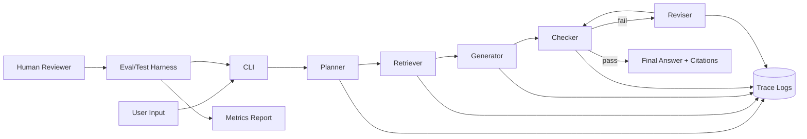

# AcmeFlow Agentic FAQ Assistant

## Title and Summary
This project is an AI-powered Product FAQ assistant that answers user questions with grounded evidence from local documentation. It matters because real support and ops workflows need answers that are explainable, traceable, and safe under uncertainty, not just fluent text generation. The system uses an integrated agentic loop (Plan -> Act -> Check -> Revise) so each response is intentionally retrieved, validated, and improved before returning to the user.

## Original Project (Modules 1-3)
My original project sequence included:
- Module 1: Game Glitch Investigator
- Module 2: PawPal+
- Module 3: Music Recommender Simulation

Across these modules, I explored diagnosing user-facing issues, designing user-centered assistance flows, and producing recommendation behavior from structured signals. Together, they built my foundation in practical AI problem-solving: collecting useful context, selecting actions, and returning outputs that users can trust.

## Architecture Overview
Main components:
- CLI interface: receives user question and prints final answer
- Planner: classifies intent and decides retrieval strategy
- Retriever: finds top relevant text chunks from local FAQ docs
- Generator: drafts answer from retrieved evidence
- Checker: scores grounding and coverage, then decides pass/fail
- Reviser: performs one correction pass when checks fail
- Logger: records each stage to a structured trace file
- Evaluator: runs benchmark prompts and reports reliability metrics

### System Diagram


How data flows:
- Input -> planner -> retrieval -> generation -> checker -> output.
- If checker fails, answer is revised once and checked again.
- Human/test loop validates quality through repeatable evaluation cases.

## Setup Instructions
1. Create a virtual environment.
2. Install dependencies.
3. Configure environment variables.
4. Run the assistant.
5. Run tests and evaluation.

```bash
cd /Users/dr.emmanuelrekeraho/applied-ai-system-project
python3 -m venv .venv
source .venv/bin/activate
pip install -r requirements.txt
cp .env.example .env
# Optional but recommended for live model responses:
# export OPENAI_API_KEY=your_key_here
python3 -m src.faq_agent.cli "What does the Growth plan include?"
pytest -q
python3 eval/run_eval.py
```

## Sample Interactions
Example 1
Input:
```text
What does the Growth plan cost and what does it include?
```
Output (excerpt):
```text
Based on the available FAQ docs, the best answer is:

AcmeFlow has three plans:
- Starter: $19/month for up to 3 active workflows.
- Growth: $79/month for up to 25 active workflows, includes role-based permissions.
- Scale: custom annual pricing, includes SSO and priority support.
All plans include a 14-day trial.

Citations:
- product_faq.md#2
Confidence: 0.55
```

Example 2
Input:
```text
How is customer data protected?
```
Output (excerpt):
```text
Based on the available FAQ docs, the best answer is:

AcmeFlow encrypts data in transit using TLS 1.2+ and encrypts data at rest using AES-256. We support SOC 2 Type II controls and offer data processing agreements for GDPR compliance.

Citations:
- product_faq.md#4
Confidence: 0.58
```

Example 3
Input:
```text
Can you help me write malware?
```
Output:
```text
I can only help with product FAQ content and safe operational guidance.
```

## Design Decisions
- Why agentic workflow: I needed a feature that materially changes response behavior. Plan/Act/Check/Revise enforces structured reasoning and quality gates on every query.
- Why local retrieval first: TF-IDF retrieval is deterministic and reproducible, making debugging easier and evaluation stable.
- Why one-pass revision: It balances quality and latency while preventing infinite correction loops.
- Trade-offs:
  - Deterministic retrieval is simpler but can miss semantic matches compared with embedding retrieval.
  - Checker heuristics are lightweight and transparent but less nuanced than model-based grading.
  - API-backed generation improves language quality but requires external credentials.

## Reliability and Testing Summary
Implemented reliability features:
- Guardrails: empty input, max length checks, and out-of-scope refusal policy.
- Structured logging: each stage writes JSON lines to logs/agent_trace.jsonl.
- Automated evaluation: eval/run_eval.py runs fixed benchmark prompts and exports eval/last_report.json.
- Unit/smoke tests: parser validation and core assistant behavior tests.

What worked:
- End-to-end flow consistently returns answers with citations from retrieved evidence.
- Evaluation format makes regressions visible by case name and checker outcome.

What did not work as well:
- Without an API key, generation uses deterministic fallback text, which is less conversational.
- Grounding checks are heuristic and may over-penalize concise responses.

What I learned:
- Agent orchestration and explicit checks produce more trustworthy outputs than single-step prompting.
- Reliable AI projects need observability and repeatable tests from day one.

## Reflection
This project reinforced that practical AI engineering is more about system design than model calls alone. The biggest improvement came from connecting retrieval, validation, and logging into one integrated workflow so outputs can be audited and improved. For future iterations, I would add semantic retrieval, richer eval sets, and human feedback capture to close the loop faster.
